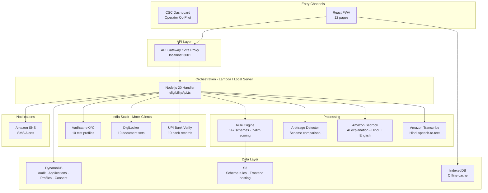

<div align="center">

# HaqDaari - Your Rights, Delivered

### AI-Powered Government Welfare Scheme Discovery & Eligibility Engine

**Rs.2.68 Lakh Crore** in welfare benefits go unclaimed every year in India.
**HaqDaari** ensures no eligible citizen is left behind.

[](https://aws.amazon.com)
[](https://aws.amazon.com/bedrock/)
[](https://indiastack.org/)
[](https://kiro.dev)
[](LICENSE)

**Team Synapses** · AWS AI for Bharat Hackathon 2025

---

</div>

## The Problem

**40-60% of eligible Indian citizens never claim their welfare benefits.**

India has **750+ government welfare schemes** across central and state levels, yet citizens miss out due to:

| Barrier | Impact |
|---------|--------|
| **Awareness Gap** | Citizens don't know which schemes exist for them |
| **Complex Forms** | Multi-page applications in English intimidate rural users |
| **Language Barriers** | 500M+ Hindi speakers can't navigate English portals |
| **Digital Illiteracy** | 65% of rural India has limited smartphone proficiency |
| **CSC Bottlenecks** | 500,000+ CSCs lack tools for efficient citizen assistance |

**Result:** Rs.2.68 lakh crore of welfare benefits go unclaimed annually.

---

## The Solution

**HaqDaari** ("Your Right") is a full-stack application that acts as a **personal welfare assistant** for every Indian citizen. One Aadhaar number. Zero forms. Full transparency.

A citizen (or CSC operator) enters a **12-digit Aadhaar number**. The system then:

1. **Fetches demographics** from Aadhaar eKYC (name, age, gender, occupation, state)
2. **Fetches documents** from DigiLocker (income certificate, caste certificate, land records)
3. **Verifies bank account** via UPI/India Stack
4. **Matches against 147 verified government schemes** using a deterministic rule engine (7-dimensional scoring: age, income, gender, caste, occupation, state, land ownership)
5. **Detects Scheme Arbitrage** - identifies better schemes the citizen is not enrolled in
6. **Generates AI explanation** via Amazon Bedrock (Hindi + English)
7. **Shows Shadow Mode preview** - citizen sees what would happen before consenting
8. **Sends SMS notification** via Amazon SNS with results summary

All of this happens in **under 2 seconds**, fully automated.

---

## Five Core Features

### 1. Zero-Touch Eligibility Engine

- Pulls demographics via **Aadhaar eKYC** (name, age, gender, address)
- Fetches documents via **DigiLocker** (income, caste, land records)
- Matches against **147 verified scheme rules** using a **deterministic rule engine** with 7-dimensional scoring
- Returns all eligible schemes in **under 2 seconds**

### 2. Scheme Arbitrage Detector

- Compares current enrollments against all eligible alternatives
- Calculates benefit differences in monetary terms
- Proactively identifies when better schemes exist
- One-click scheme switch initiation

### 3. Shadow Mode - Transparent AI

- Every AI action previewed in **simple Hindi** before execution
- Citizens can approve, modify, or cancel
- Full audit trail: every action logged with timestamp + approval status
- Bilingual preview (Hindi + English)

### 4. CSC Co-Pilot (Offline-First)

- **3-column dashboard**: API log · citizen profile · auto-filled form
- **IndexedDB** local storage - works without connectivity
- Auto-syncs queued applications when back online (zero data loss)
- Operators can "Apply All" with one click

### 5. Bilingual PWA

- **React PWA** with service workers for offline caching
- Every screen shows both **Hindi** and **English** text
- WhatsApp-style chat demo for conversational interaction
- Bottom nav with quick access to all features

---

## Architecture



## Scheme Data Sources

All 147 schemes are **real government programs** with verifiable source URLs:

| Category | Count | Source |
|----------|-------|--------|
| Central Government | 96 | myscheme.gov.in, Ministry websites, PIB |
| Uttar Pradesh | 6 | mksy.up.gov.in, sspy-up.gov.in |
| Bihar | 5 | sspmis.bihar.gov.in, medhasoft.bih.nic.in |
| Madhya Pradesh | 5 | ladlilaxmi.mp.gov.in, sambal.mp.gov.in |
| Tamil Nadu | 5 | tnsocialwelfare.tn.gov.in, fisheries.tn.gov.in |
| Rajasthan | 5 | chiranjeevi.rajasthan.gov.in, sje.rajasthan.gov.in |
| Kerala | 5 | welfarepension.lsgkerala.gov.in, kasp.kerala.gov.in |
| Odisha | 5 | kalia.odisha.gov.in, subhadra.odisha.gov.in |
| Maharashtra | 5 | jeevandayee.gov.in, ladakibahin.maharashtra.gov.in |
| Gujarat | 5 | sje.gujarat.gov.in, gujaratindia.gov.in |
| Jharkhand | 5 | jrfry.jharkhand.gov.in, ekalyan.cgg.gov.in |

> **Note**: Scheme names are verified real programs (PM-KISAN, PMJAY, KALIA, Chiranjeevi, Ladki Bahin, etc.). Specific benefit amounts and eligibility criteria are approximate and sourced from publicly available information as of 2024-25. For production, integrate with the MyScheme.gov.in API (requires government partnership for auth).

---

## Tech Stack

| Layer | Technology | Purpose |
|-------|-----------|---------|
| **Frontend** | React 18, TypeScript, Vite 6, Tailwind 3, Framer Motion | PWA with service workers for offline support |
| **State** | Zustand | Minimal, fast, no boilerplate |
| **Offline** | IndexedDB | CSC kiosks may lose connectivity |
| **Backend** | Node.js 20, TypeScript, AWS SDK v3 | Lambda-compatible, type-safe |
| **API** | HTTP API Gateway (v2) | Low-latency, cost-effective |
| **Database** | DynamoDB (PAY_PER_REQUEST) | Zero idle cost, auto-scaling |
| **AI/ML** | Amazon Bedrock (Titan/Claude) | Hindi NLP, form fill, explanation |
| **Voice** | Amazon Transcribe | Hindi speech-to-text |
| **Notifications** | Amazon SNS | SMS delivery |
| **IaC** | Terraform | Reproducible, version-controlled |
| **Monitoring** | CloudWatch (logs + alarms) | Error tracking, latency metrics |
| **Cost Control** | AWS Budgets ($50 alarm) | Prevent bill shock |
| **India Stack** | Aadhaar eKYC + DigiLocker + UPI | Citizen verification (mock for demo) |
| **Spec Tool** | Kiro | Requirements & design specification |

---

## Project Structure

```
project_files/
├── backend/
│   ├── package.json
│   ├── tsconfig.json
│   └── src/
│       ├── local-server.ts
│       ├── handlers/
│       │   └── eligibilityApi.ts
│       ├── clients/
│       │   ├── aadhaarClient.ts
│       │   ├── bedrockClient.ts
│       │   ├── digilockerClient.ts
│       │   ├── dynamoClient.ts
│       │   ├── snsClient.ts
│       │   ├── transcribeClient.ts
│       │   └── upiBankClient.ts
│       └── services/
│           ├── eligibilityService.ts
│           └── arbitrageService.ts
│       
├── frontend/
│   ├── package.json
│   ├── vite.config.ts
│   ├── tailwind.config.js
│   └── src/
│       ├── App.tsx
│       ├── api.ts
│       ├── store.ts
│       ├── offlineDb.ts
│       ├── components/
│       │   ├── Layout.tsx
│       │   ├── SchemeCard.tsx
│       │   └── ShadowModal.tsx
│       └── pages/
│           ├── Home.tsx
│           ├── Onboarding.tsx
│           ├── EligibilityCheck.tsx
│           ├── Results.tsx
│           ├── SchemeComparison.tsx
│           ├── SchemeArbitrage.tsx
│           ├── ApplicationForm.tsx
│           ├── Tracking.tsx
│           ├── Notifications.tsx
│           ├── Profile.tsx
│           ├── CscDashboard.tsx
│           └── WhatsAppDemo.tsx
│       
├── shared/
│   └── types/
│       ├── index.ts
│       ├── CitizenProfile.ts
│       ├── EligibilityResult.ts
│       ├── SchemeRule.ts
│       └── ShadowPreview.ts
│       
├── data/
│   ├── generate-schemes.js
│   └── schemes/
│       └── all-schemes.json
│       
├── infra/
│   ├── main.tf
│   ├── resources.tf
│   └── outputs.tf
│       
├── SETUP_AND_DEPLOY.md
└── README.md
```

---

## Quick Start (Local Development)

### Prerequisites

| Tool | Version | Check |
|------|---------|-------|
| Node.js | >= 18 (tested on 20.x) | `node --version` |
| npm | >= 9 | `npm --version` |

No AWS account needed for local development.

### Step 1: Clone and Install

```bash
git clone <repo-url>
cd HaqDaari-gh/project_files
npm install
```

### Step 2: Start the Backend

```bash
npm run backend:dev
```

### Step 3: Start the Frontend

```bash
cd project_files/frontend
npm run dev
```

Opens at `http://localhost:5173`.

### Step 4: Test Profiles

| Aadhaar | Name | Occupation | Income | State | Expected Schemes |
|---------|------|------------|--------|-------|-----------------|
| 111122223333 | Sunita Devi | daily_wage | Rs.48K | Bihar | ~54 |
| 222233334444 | Lakshmi Narayanan | fisherman | Rs.60K | Tamil Nadu | ~30 |
| 333344445555 | Priya Sharma | self_employed | Rs.1.5L | Rajasthan | ~49 |
| 444455556666 | Arjun Vishwakarma | artisan | Rs.96K | Madhya Pradesh | ~38 |
| 555566667777 | Biju Mohan | farmer | Rs.84K | Kerala | ~47 |
| 666677778888 | Meena Kumari | weaver | Rs.36K | Odisha | ~52 |
| 777788889999 | Rajendra Patil | farmer | Rs.5L | Maharashtra | ~33 |
| 888899990000 | Kavita Singh | street_vendor | Rs.1.2L | Gujarat | ~49 |
| 999900001111 | Mahendra Oraon | farmer | Rs.10L | Jharkhand | ~31 |
| Any 12-digit | Ramesh Kumar | farmer | Rs.72K | Uttar Pradesh | ~49 |

### Step 5: API Reference

| Method | Endpoint | Body | Description |
|--------|----------|------|-------------|
| POST | `/api/eligibility` | `{ "aadhaarNumber": "111122223333" }` | Full eligibility pipeline |
| POST | `/api/applications` | `{ "citizenId":"...", "schemeId":"PM-KISAN", ...}` | Submit application |
| GET | `/api/applications?citizenId=xxx` | - | List applications |
| POST | `/api/transcribe` | `{ "audioContext":"default"}` | Hindi voice to text |
| POST | `/api/form-fill` | `{ "citizenName":"Sunita Devi", "schemeId":"PM-KISAN"}` | AI form fill |
| POST | `/api/knowledge-base` | `{ "query":"..."}` | Knowledge base Q&A |
| GET | `/api/audit` | - | All audit events |

---

## Eligibility Engine

The rule engine scores each citizen against each scheme on 7 dimensions:

| Dimension | Scheme Field | Profile Field | Logic |
|-----------|-------------|---------------|-------|
| Age | `ageMin`, `ageMax` | `age` | Range check |
| Income | `incomeCeiling` | `income` | `profile.income <= scheme.incomeCeiling` |
| Gender | `gender[]` | `gender` | Array membership |
| Caste | `caste[]` | `caste` | Array membership (case-insensitive) |
| Occupation | `occupation[]` | `occupation` | Array membership (case-insensitive) |
| State | `state[]` | `address.state` | Array membership (state schemes only) |
| Land | `landOwnership{min,max}` | `landOwnership` | Range check |

A scheme is eligible if the citizen scores 70% or above across all applicable criteria.

---

## AWS Cloud Deployment

### Prerequisites

| Tool | Version |
|------|---------|
| AWS CLI v2 | `aws --version` |
| Terraform | >= 1.5 |
| AWS Account | Admin access |

```bash
cd project_files/infra
tf init
tf plan
tf apply
```

## Cost Estimate (Demo)

| Resource | Monthly Cost |
|----------|-------------|
| Lambda (1K requests/day) | ~$0.00 (free tier) |
| API Gateway | ~$0.00 (free tier) |
| DynamoDB (PAY_PER_REQUEST) | ~$0.00 (free tier) |
| S3 (schemes + frontend) | ~$0.05 |
| CloudFront | ~$0.00 (free tier) |
| Bedrock (if enabled) | ~$1-5/month |
| SNS SMS (if enabled) | ~$0.50/month |
| **Total** | **~$1-6/month** |

Full RAG with OpenSearch Serverless = $350+/month.

---

## Impact Potential

| Metric | Value |
|--------|-------|
| **Addressable Population** | 80 crore citizens eligible for welfare schemes |
| **Unclaimed Benefits** | Rs.2.68 lakh crore annually |
| **CSC Network** | 500,000+ Common Service Centers nationwide |
| **WhatsApp Reach** | 500M+ Indian users - largest messaging platform |
| **Hindi Speakers** | 600M+ native speakers served in their language |
| **2G Compatibility** | Works on basic phones with minimal data |

---

## Specification Artifacts

### [`requirements.md`](requirements.md)
- **15 functional requirements** with formal acceptance criteria
- Covers all 5 core features + scalability, security, language, error handling, analytics, MVP phasing
- Uses **WHEN/SHALL/IF-THEN** syntax for machine-verifiable specifications
- **75+ acceptance criteria** - every edge case documented

### [`design.md`](design.md)
- **Full system architecture** with Mermaid diagram (renders on GitHub)
- **7 component interfaces** with request/response contracts
- **6 TypeScript data models** (CitizenProfile, SchemeRule, Session, Application, etc.)
- **46 correctness properties** with full traceability to requirements
- **Error handling**: retry logic, circuit breakers, 4 graceful degradation scenarios
- **Testing strategy**: unit, property-based (fast-check), integration, performance, security, E2E
- **Deployment architecture**: Lambda config, DynamoDB, S3, Bedrock, Greengrass, monitoring, cost

---
<div align="center">

**HaqDaari** - Because every Indian deserves their right.

Built on [AWS](https://aws.amazon.com) · Powered by [India Stack](https://indiastack.org/)

**Team Synapses** · AWS AI for Bharat Hackathon 2025

</div>
